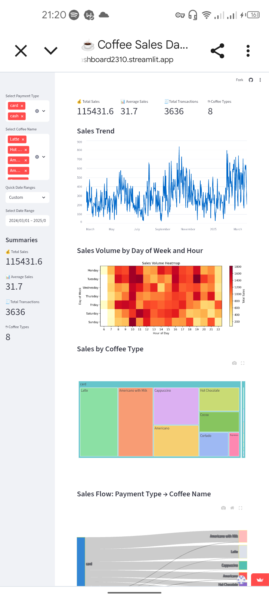

# Streamlit2 - An interactive dashboard With customizations.
Experiment with streamlit


<!--  -->
## Overview

This project is an experiment using [Streamlit](https://streamlit.io/) to build interactive dashboards and data applications.

## Features

- Interactive data visualization
- Streamlit deployment

## Live Demo

[](https://coffeedashboard2310.streamlit.app/)

## Getting Started

1. Clone the repository:
    ```bash
    git clone https://github.com/yourusername/streamlit2.git
    cd streamlit2
    ```
2. Install dependencies:
    ```bash
    pip install -r requirements.txt
    ```
3. Run the app:
    ```bash
    streamlit run app.py
    ```


